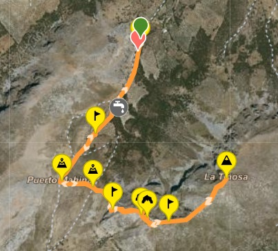

# Subida a la Tiñosa: Ruta de Senderismo en Córdoba

La **Tiñosa**, situada en la Sierra de la Horconera, es el pico más alto de la provincia de Córdoba con 1.570 metros de altitud. Se trata de una ruta muy popular entre senderistas que buscan disfrutar de vistas espectaculares y una experiencia inolvidable.

## Descripción de la Ruta

La ruta comienza en el municipio de **Priego de Córdoba**. Desde allí, ascenderemos por un camino bien señalizado hasta alcanzar la cima de la Tiñosa. Durante el trayecto, disfrutarás de paisajes rocosos, vegetación típica mediterránea y vistas panorámicas de la sierra.

- **Distancia**: 10 km (ida y vuelta)
- **Desnivel acumulado**: 900 metros
- **Duración**: Aproximadamente 5 horas
- **Dificultad**: Moderada

## Puntos de Interés

Durante el recorrido, estos son algunos de los puntos más destacados:

1. **El Collado de la Morrena**: Un lugar clave desde donde se puede apreciar una magnífica vista de las sierras circundantes.
2. **La Cima de la Tiñosa**: El objetivo de la ruta, con un hito geodésico que marca el punto más alto de la provincia.

## Equipamiento Recomendado

Es fundamental estar bien equipado para afrontar la ruta con seguridad:

- **Calzado**: Botas de senderismo con buen agarre.
- **Ropa**: Ropa transpirable y a prueba de viento, ya que la temperatura puede bajar al acercarse a la cima.
- **Agua y comida**: Al menos 1,5 litros de agua y algún snack para recuperar energía durante el recorrido.
- **Protección solar**: Gafas de sol, protector solar y gorra.

## Cómo Llegar y Descargar la Ruta

El punto de partida de esta ruta es el pueblo de **Priego de Córdoba**, accesible en coche desde Córdoba capital en aproximadamente una hora.

Si deseas seguir la ruta exacta con GPS, puedes descargarla desde [Wikiloc](https://www.wikiloc.com), donde muchos usuarios comparten sus experiencias y trayectos. Solo tienes que buscar "Subida a la Tiñosa" y elegir la opción que mejor se adapte a tus necesidades.

## Recomendaciones y Consejos

Antes de empezar la ruta, asegúrate de consultar la previsión meteorológica y evitar días de mucho calor o lluvia. Es una subida que requiere buena forma física, por lo que conviene tomárselo con calma y disfrutar del paisaje.

---

**Autor**: Mario Palacios Moreno